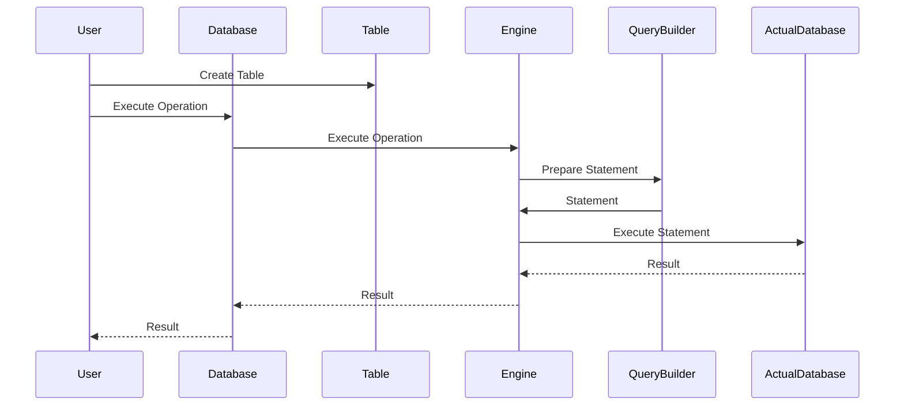

# What - A simple orm


The project aims to implement basic functionalities for interacting with a database in an intuitive manner. The usage in the code is similar to popular ORMs, such as SQLAlchemy.


### A couple of examples:

Instantiate a DB object:

```python
    connection_info = {
        'host': 'localhost',
        'database': 'postgres',
        'user': '*****',
        'password': '*****',
    }
    engine = create_engine(connection_info)
    db = dbsession(engine=engine, autocommit=True)
```

Declare a table object:

```python
    Table = table_base()
    class User(Table):
        id = Column(type=Integer(), name='id', primary_hey=True)
        test = Column(
            type=String(),
            name='test',
            default='default',
            nullable=True
        )
```

Statements:

```python
    ## create

    db.create(User)

    ## select

    db.select(
        table=User,
        columns=[User.id, User.test],
        conditions=[User.id == 'id'],
        group_by=[User.id],
        order_by=[User.id],
        ascending_order=False
    )

    ## update

    db.update(
        table=User,
        set_columns=[User.id == 'new_id']
        conditions=[User.id == 'id']
    )
```


# Why - the goal

My choice to develop a Python ORM aimed to bridge the gap between object-oriented programming and databases; in the perspective of learning by doing, developing this project provided a hands-on understanding of how data is stored and retrieved, deepening comprehension of object-oriented principles and class design.

# How - under the hood

